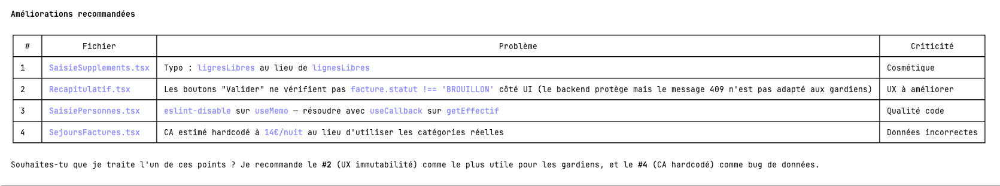
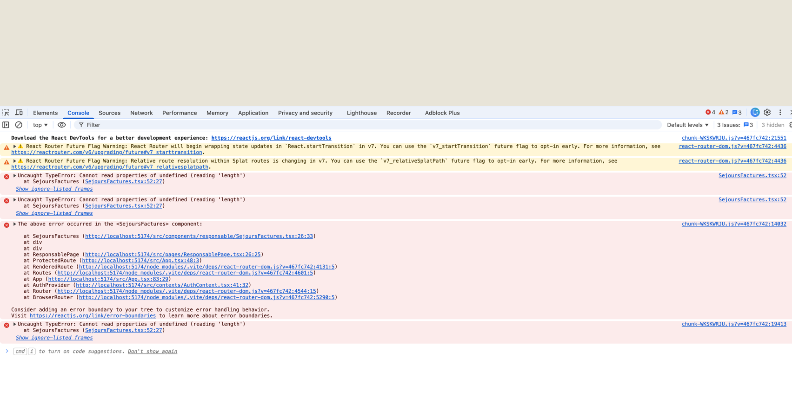
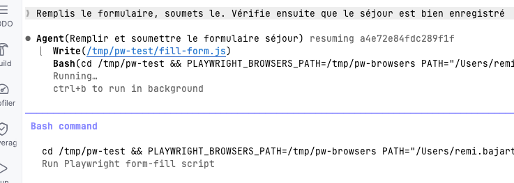
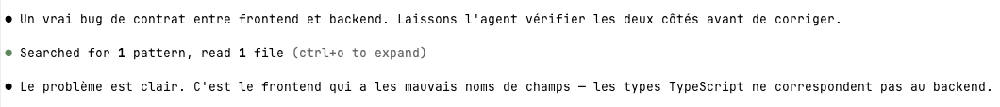
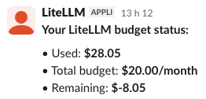

## Implém frontend
Claude (free) a généré les maquettes HTML interactives dans le dossier `maquettes/`.
(mettre une image qui supprime les designers)

Claude code a ensuite pris le relais, 
entre les specs et les maquettes, 51k tokens (soit pas beaucoup au final) et un gros 30 minutes, 
claude a pondu tout le frontend React + Amplify.
Egalement installé npm et tout le bordel pour que ça marche, 

                  Premiere erreur au run
❯ etq resp location, j'ai cette erreur quand je clique sur séjours & facures

Premiers constats : peu de contrôles sur le budget réellement utilisé,  
ce genre d'infos en apporte un peu mais on ne pense pas tj à le sauvegarder.
surtout que c'est prompt par prompt

A premiere vue peu de dofférence entre "low thinking" et "high thinking" : 
la différence notable était que en mode "high" il a relancé les tests et mis à jour les specs avec - conformément aux instructions.
(pas testé sur le meme cas exactement)

            
Fonctions ajoutées : 
- Hook pour   transcript le prompt + résumé du retour (+ nb token ajoutés après) . Hook écrit et configuré par claude lui meme

Playwright : outil de test end to end, qui simule les interactions utilisateur (click, etc.) et vérifie que l'interface réagit comme prévu.
Pilote le bro
- tests écrits par claude lui meme, avec une bonne couverture des cas d'usage
         
Détecte et corrige les bugs seuls

ceci aurait probablement pû etre évité avec un prompt explicite dès le début, mais on pouvait légitimement penser que l'IA le ferait naturellement
A noter que les maquettes ont été faites en 1er, puis le back, puis implém du front.

Consommation des tokens :
- sous agents non inclus dans le résumé
-  / 
- Pas de bloquage mmédiat par litellm
- 

Bilan : reste plus "focus" que copilot (sonnet 4.5 ?? : finit la tache en entier, meme si c'est plus long 
j'avais souvent vu copilot (sonnet 4.5 ? gpt 5.1 ?) faire que la moitié d'une tache puis l'indiquer comme terminée...)
                    

HAIKU 
